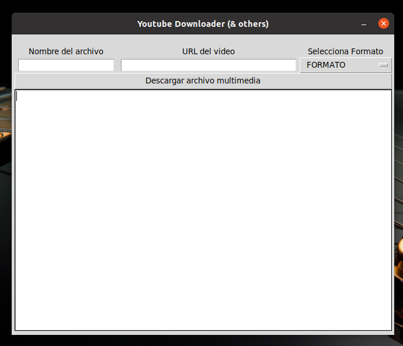
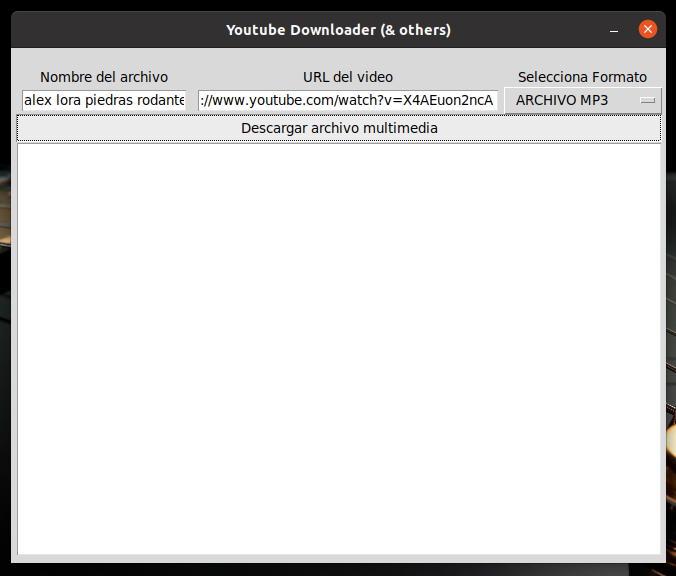
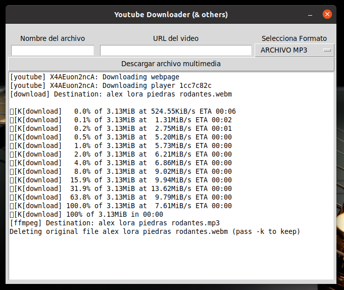
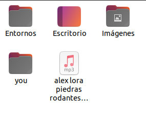

# YoDow (Interfaz gráfica para Youtube-DL) --> Debian/Ubuntu

## Requisitos:


### Proceso para dar de alta entorno:
```bash         
cd /opt && sudo virtualenv -p python3 y 
sudo chmod 777 -R y
source y/bin/activate
pip install youtube-dl
sudo chmod 755 -R y
sudo apt install ffmpeg -y
```            
### Descargar el archivo "tar.gz" extraerlo y hacer lo siguiente:
```bash
sudo mv yodow /opt/y/
sudo mv d.png /opt/y/
mv yodow.desktop ~/.local/share/applications
```

### Interfáz gráfica para Youtube-DL (Descarga vídeos en la mejor calidad y MP3 a 320Kbps)



#### Proceso de descarga: 

  


#### Resultado:



